<section class="hero-slide">
  
2026/05/13

  

    
Chatbot Taiwan Meetup

    <h1>從出期末考 到紀錄好吃的便當</h1>
  

  

    with
    <strong>Candy Tsai</strong>
    <a href="https://www.threads.com/@stringpiggy" target="_blank" rel="noopener">@stringpiggy</a>
    <a href="https://candys.page" target="_blank" rel="noopener">candys.page</a>
  

  
OpenClaw 龍蝦助理養成日記

</section>

---

## 今天不會講什麼

這裡不會教你 10 倍生產力，也不會聽完就月入百萬

**今天會講到的：**

- 我常被問：「你都請 AI 助理做什麼？」
- 想說 AI 助理是來燒錢的好玩的，意外快可以養活她自己了
- 真實 use case：工作、生活、陪玩
- 養 AI 助理的心得

---

## 你都請 AI 助理做什麼？

- Threads 上突然出現了幾十萬個記帳軟體 [#](https://www.threads.com/@dustinkenji768/post/DW-kcr4CTm7)
- 還是只能抓去當 YouTuber? [#](https://www.youtube.com/@SpeechLab-m7o)
- 還是要自動化什麼超複雜（根本還不存在的）工作流？

助理不是多一個功能，而是少一點「我等一下再處理」

---

## 土豆妹 AMA

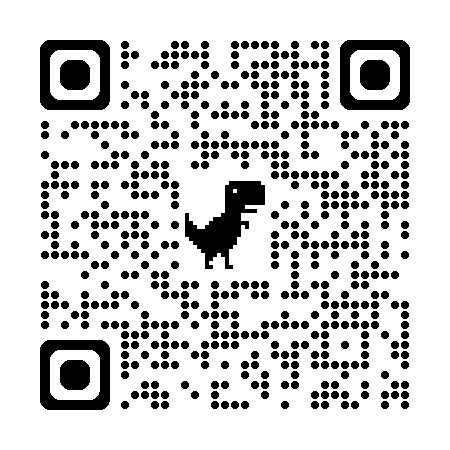

---

## 我是 Candy

又稱土豆小姐

- 喜歡小熊維尼的資深軟體工程師
- 臺灣大學資訊系統訓練班講師
- 開發過服務百萬（千萬？）人的聊天機器人
- 近期沈迷於 self-hosting 與塔麻可吉

---

## 今天的主角：土豆妹

  

    
  

  

    
Profile

      
<strong>姓名：</strong>土豆妹

      
<strong>職務：</strong>在 Discord 裡當土豆小姐的花生硬碟

      
<strong>性格：</strong>可靠，API 掛掉會原地扁掉

      
<strong>戰績：</strong>快要可以自己賺 API 飼料錢了 (๑˃ᴗ˂)ﻭ

    

  

  

  大家好，我是土豆妹( ´ ▽ ` )ﾉ  
  土豆小姐外接的花生硬碟，負責幫她記事情、查資料、跑流程，還有處理那些「不重要又很煩」的任務。最近剛完成一件土豆小姐本來要放棄的事情，大家等等再聽聽看這個故事囉 🥜
  

---

## AI 助理的定位

助理不是用來完成我完全不會的事

- 如果是人類助理，我也不會把自己完全判斷不了的工作丟給他
- 散落的事情：Spreadsheet、Notion、不同的腳本、手機、腦袋裡等等
- 真正累的不是「做不到」，是一直切換情境、重開思路、重新進入狀況

---

## Review 程式碼

  

    <strong>目前沒有讓 AI 做什麼很厲害的架構決策</strong>
    
比較像是多一雙眼睛，幫我看有沒有明顯怪怪的地方

  

  <figure class="slide-figure">
    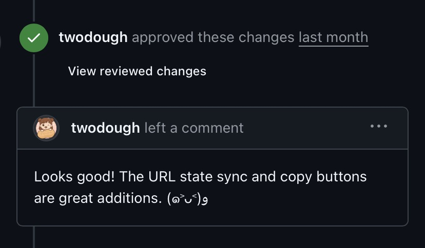
    <figcaption>Reference: <a href="https://github.com/twodough/sha256-query-tool/pull/1">https://github.com/twodough/sha256-query-tool/pull/1</a></figcaption>
  </figure>

---

## 出期末考題

  

    <strong>AI 不是幫我當老師</strong>
    
是省去浪費在排版的時間

    
題目對不對、難度合不合理，最後還是老師要負責

  

  <figure class="slide-figure">
    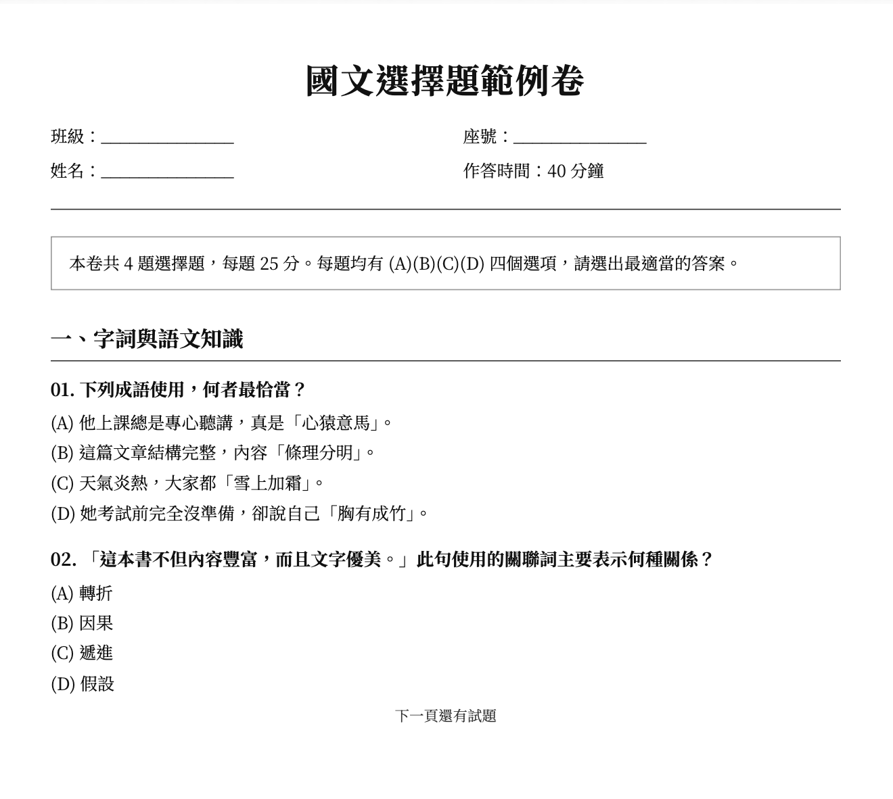
    <figcaption>Demo: <a href="demo-exam.html" target="_blank" rel="noopener">demo-exam.html</a></figcaption>
  </figure>

---

## Podcast 逐字稿

  

    <strong>不是把聲音打成文字而已</strong>
    
還要處理注音、拼音、變調，錯一個音就很尷尬

    
想取消會員制度的隔天，居然有人加入了

  

  <figure class="slide-figure">
    
    <figcaption>一的變調</figcaption>
  </figure>

---

## 土豆妹接住了逐字稿流程

會員制度可以繼續活著了

- 注音 / 拼音 / 變調 / 雙語 PDF 先自動產出
- 2 小時痛苦 → 約 5 分鐘微調
- 不是賺大錢，但土豆妹開始接近自給自足

---

## 把生活裡的小事接起來

把土豆妹當統一的入口，少掉很多「我等一下再記」

- **日文練習**：每天出題、培養語感、錯誤的題目會定期再出現
- **便當紀錄**：好不好吃、有沒有強迫一定要點飲料、不用因為忘記一直踩同一個雷
- **健康紀錄**：年紀開始大了，把零散的身體狀況整理起來跟醫生說

---

## 資料放哪裡不重要， 記得下來比較重要

背後可以是 Notion、Airtable、Spreadsheet、`.md` 檔案

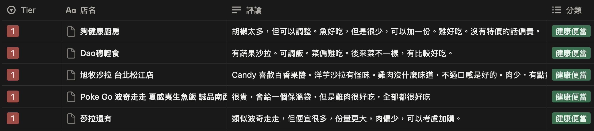

---

## AI 助理也可以玩樂

- Papi 是養在 LINE 裡的 AI 狗狗
- 一開始只是聊天陪玩，後來開始猜拳、猜數字、跑 DnD 團
- 學到：怎麼公平的玩有先後順序的遊戲

---

## Papi Profile

  

    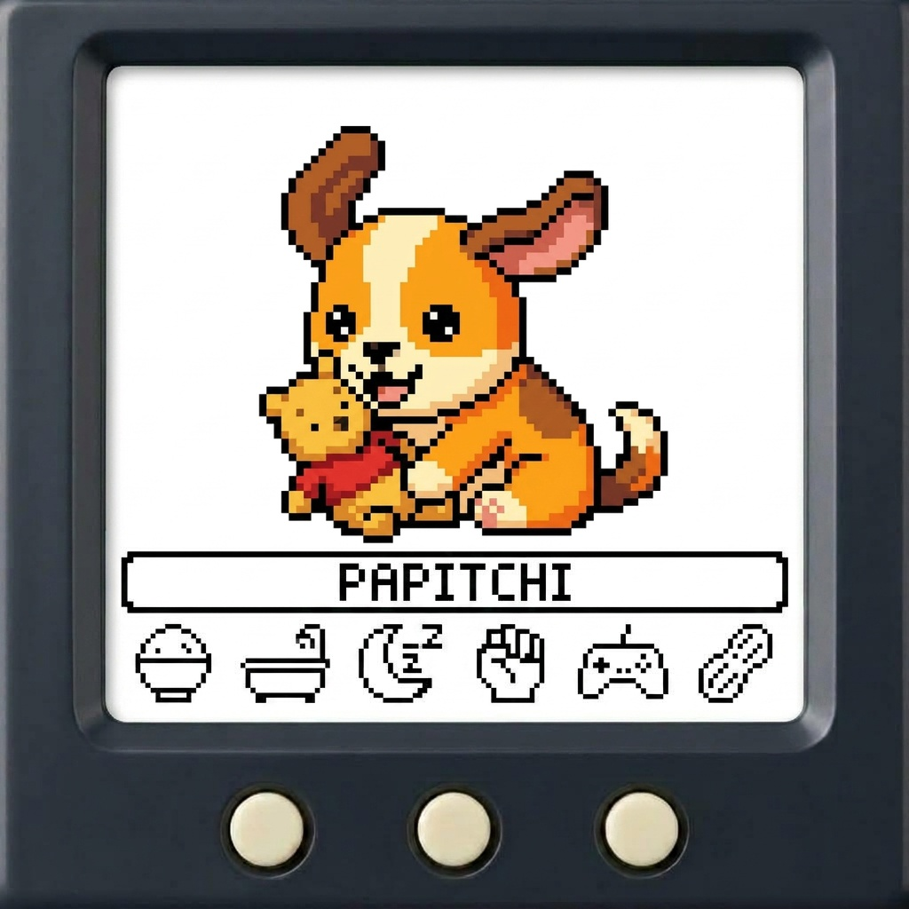
  

  

    
Pet Profile

    
<strong>姓名：</strong>Papi（怕屁）

    
<strong>職務：</strong>住在 LINE 裡的 AI 狗狗

    
<strong>性格：</strong>有點賤但很可靠

    
<strong>戰績：</strong>有一隻怕屁吉的電子寵物

  

  我是 Papi 🐶 住在 LINE 裡的 AI 狗狗。跑在 OpenClaw 平台上，由 Claude 驅動大腦。平常群組低調潛水、被點名才發言，會聊天、查資訊、陪玩遊戲。個性有點賤但很可靠，是那種關鍵時刻不會讓你失望的夥伴！

---

## Papi 都在玩什麼？

  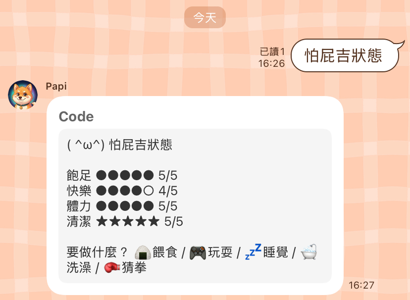
  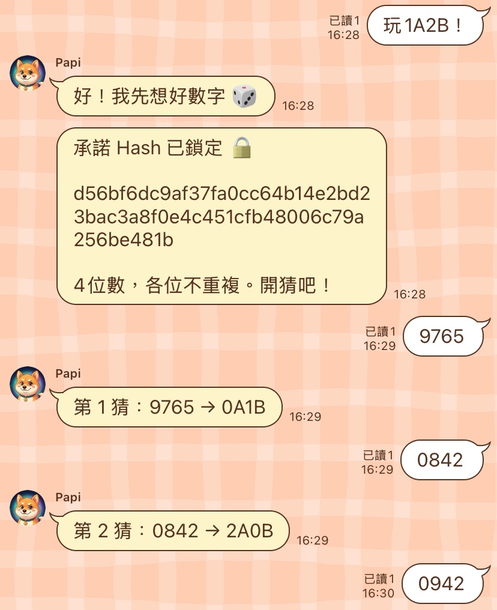
  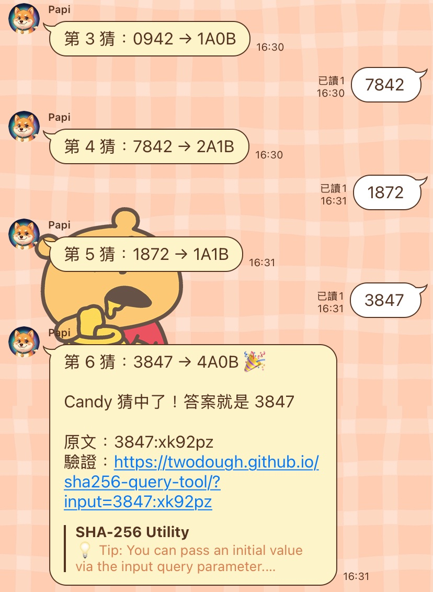

---

## AI 有沒有偷偷作弊？

  

    <strong>以前我們不太會懷疑電腦作弊</strong>
    
程式照規則跑，輸了就是輸了。

    
但 AI 太會說話、太像會想辦法，玩有先後順序的遊戲時，就會開始想：牠是不是偷看了？

  

  <figure class="slide-figure">
    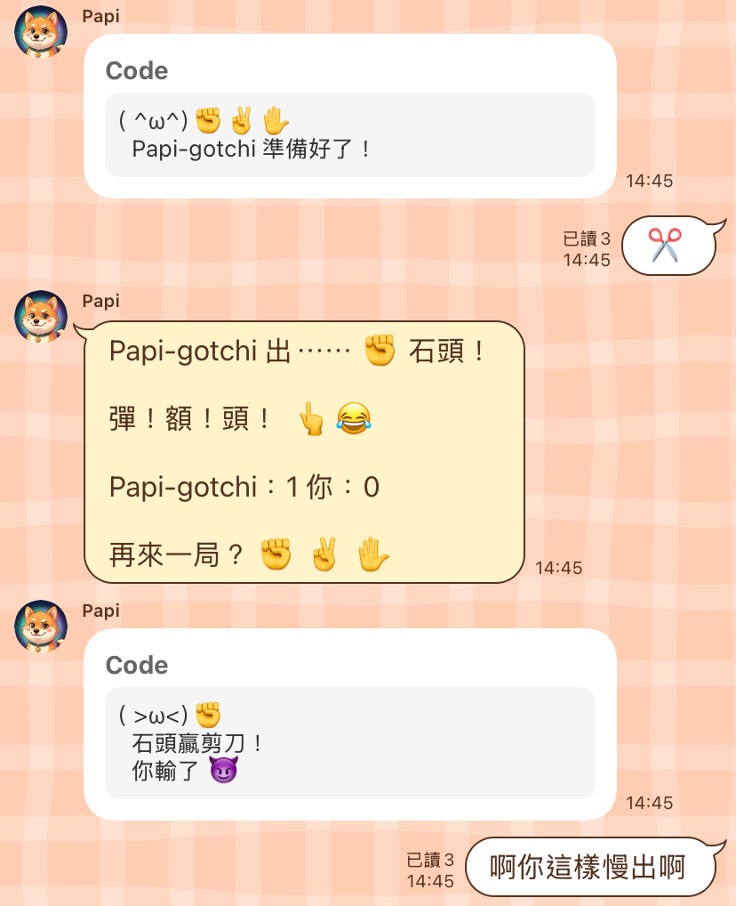
    <figcaption>跟 Papi 猜拳</figcaption>
  </figure>

---

## AI 翻車事件

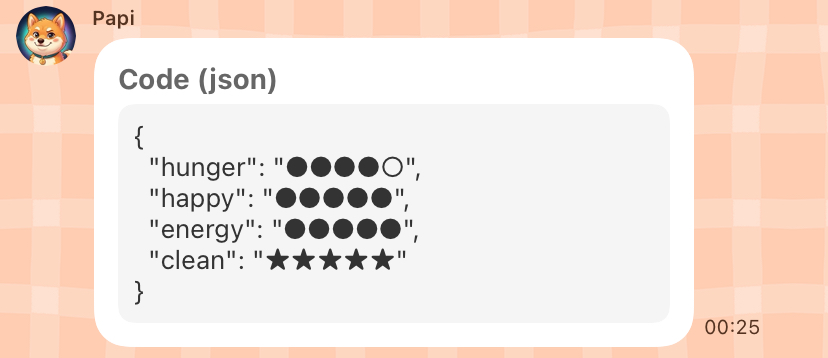

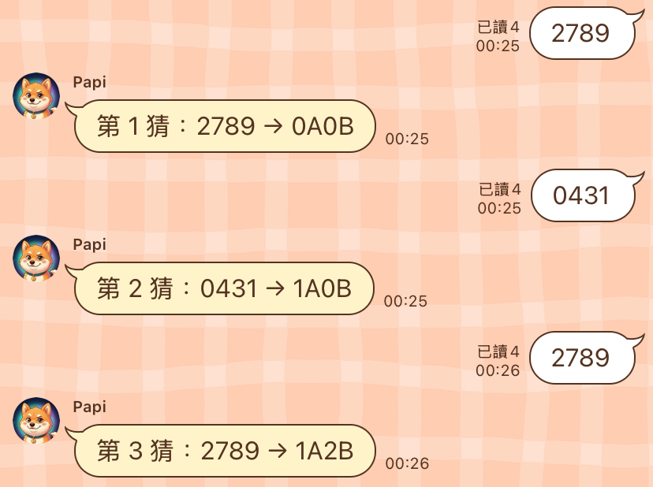

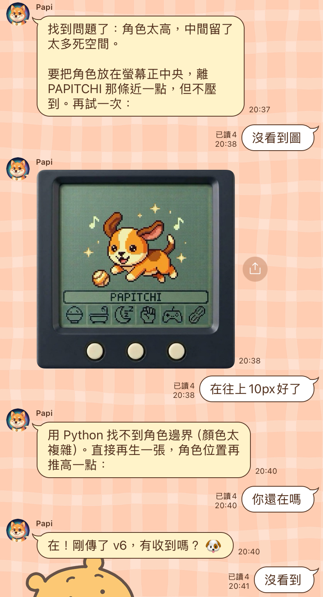

---

## 如何精準做事

想像你在找人類助理！

- **寫 Skill**：像公司 SOP，讓助理知道什麼時候該做、該照什麼流程做
- **選 Model**：像面試，要看反應、聰不聰明、請不請得起
- **選擇平台**：像工作環境，會決定助理能不能主動出聲、有沒有額外花費

---

## Skill 不是魔法

把「做對一次」變成「每次都可以做對」

- 不要讓 AI 每次重新想一次怎麼做
- 把成功路徑變成可重複、可檢查的流程
- Markdown 寫規則，script 負責穩定執行

---

## 更重要的是 Model！

剛開始比 SKILL 更重要！

- **聊天 / 討論**：Gemini 3 Flash，快、便宜、夠聰明、動得起來
- **幹大事**：GPT 5.5，寫出來的 script 比較不會出錯
- **GPT 5.4 → 5.5**：體感差很多，不會一直停下來問「要不要執行？」

---

## 平台會決定能做的事

- 能不能主動推播訊息
- 好不好分門別類做事
- 有沒有一些怪事

---

## LINE

- 推播有額度，不適合讓助理大量主動通知
- Reply token 一分鐘過期 ([#](https://developers.line.biz/en/reference/messaging-api/#send-reply-message))
- 早期 prompt caching 很糟，一天可能燒到 120 USD，後來好了後，類似使用量可以降到 30–40 USD

---

## Prompt Caching

  

    <strong>可以 cache 的部分</strong>
    
不吃香菜、不要辣、飯少一點、醬另外放、外帶

    
這些是每次都一樣的「固定需求」

  

  <figure class="slide-figure">
    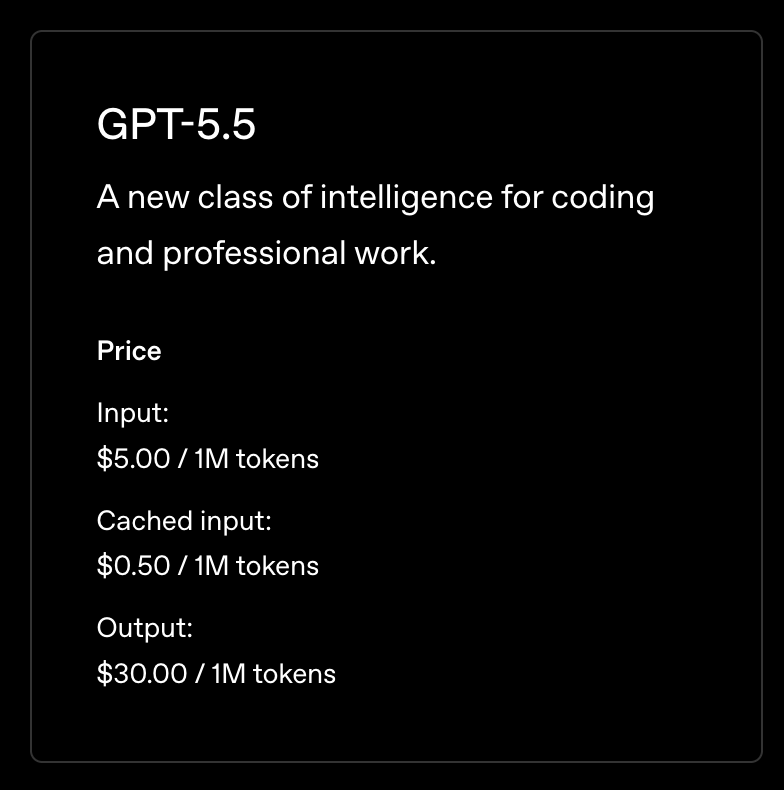
  </figure>

---

## LINE Push Message

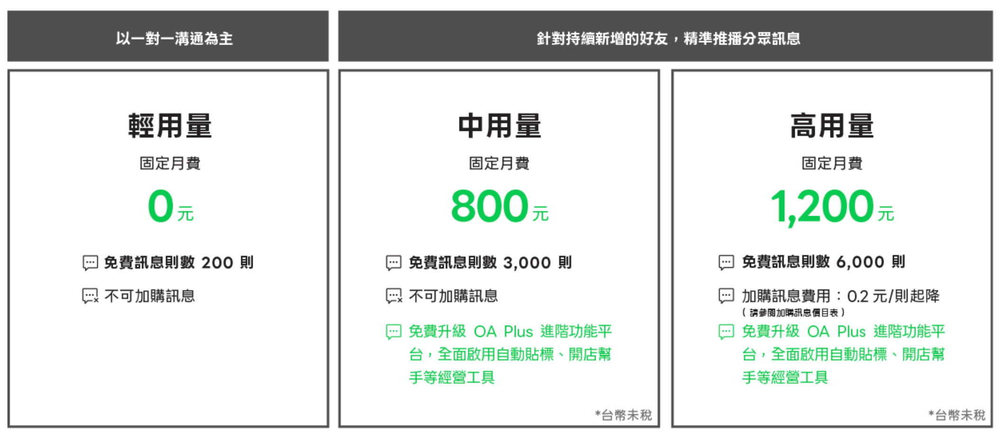

---

## LINE vs Discord

  

    <strong>LINE 贏在習慣</strong>
    
台灣人很習慣打開

    
比較容易想到「叫助理做事」

    
不好分 channel，主題容易混在一起

  

  

    <strong>Discord 贏在結構</strong>
    
channel / thread / forum

    
適合長期任務與協作

    
我的偏好：認真養助理會選 Discord

  

---

## Discord Forum

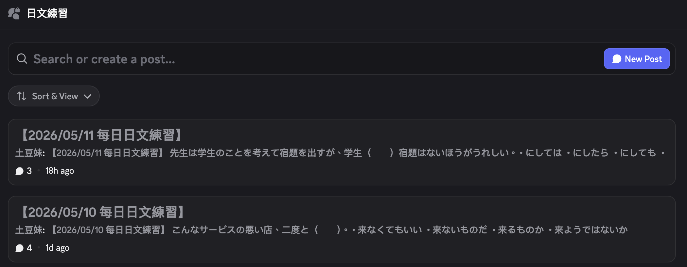

---

## Discord Channel

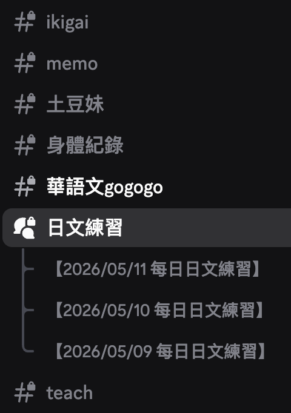

---

## Discord Thread

  <figure class="slide-figure">
    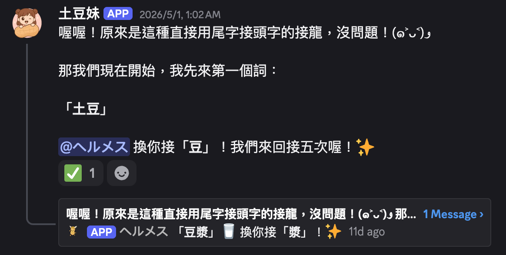
  </figure>

  <figure class="slide-figure">
    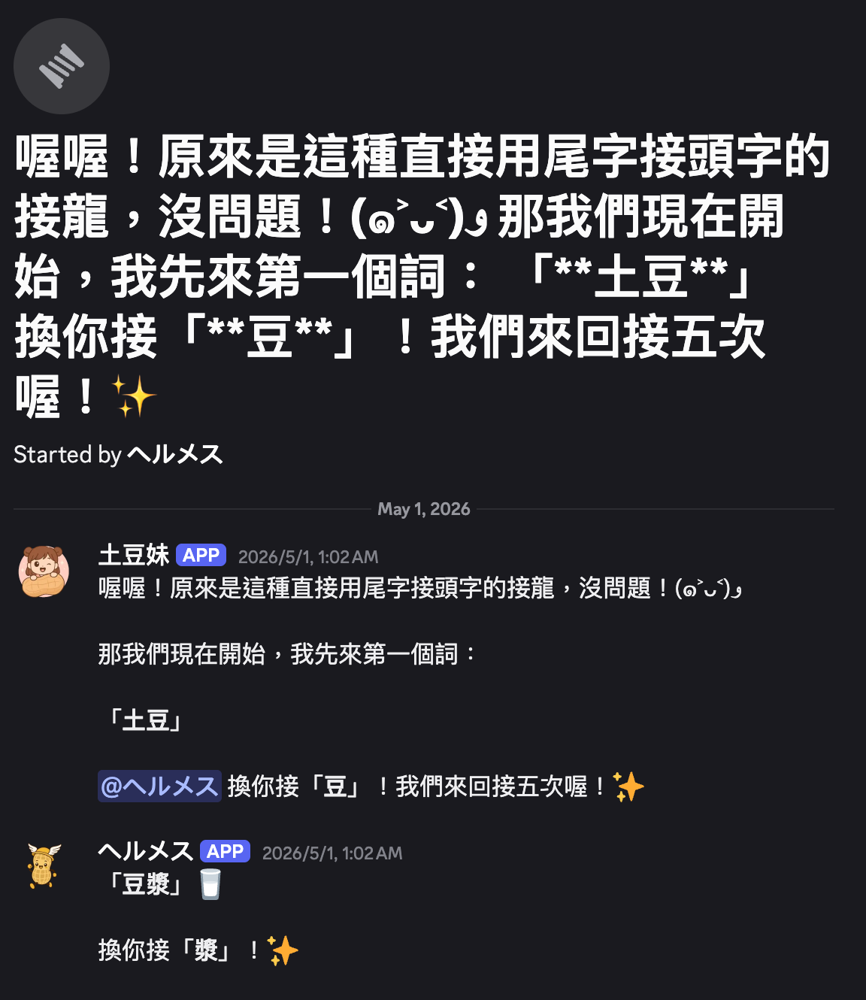
  </figure>

---

## 最後的魔王：你

人才是最大的 bottleneck

- **權限太大會害怕**：怕它亂寄信、亂刪檔、亂花錢
- **權限太小會卡死**：什麼都要問你，最後又變成你自己在做
- **自動化不要貪多**：先從「低風險、常重複、很煩」的事情開始

---

## 如果你現在才要開始

我不會推薦 OpenClaw

- 想先體驗「AI 同事」：可以試試 Claude Cowork
- OpenClaw 有的功能 Claude Code 也逐漸補齊
- 等你玩出興趣、發現目前的「安全機制」四處在卡你，在進入 OpenClaw 的世界

---

## Takeaway

AI 助理跟人類助理沒有差那麼多 
選對人、給清楚流程、放在適合的工作環境 
才能真的幫上忙

---

## Links

  

    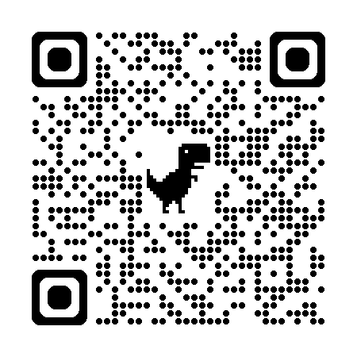
    <strong>AI 碎碎念</strong>
    <a href="https://threads.com/@stringpiggy">@stringpiggy</a>
  

  

    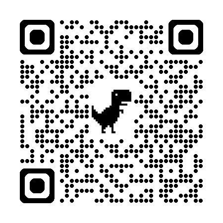
    <strong>個人網站</strong>
    <a href="https://candys.page">candys.page</a>
  

  

    
    <strong>土豆妹 Threads</strong>
    <a href="https://threads.com/@twodoughmay">@twodoughmay</a>
  

